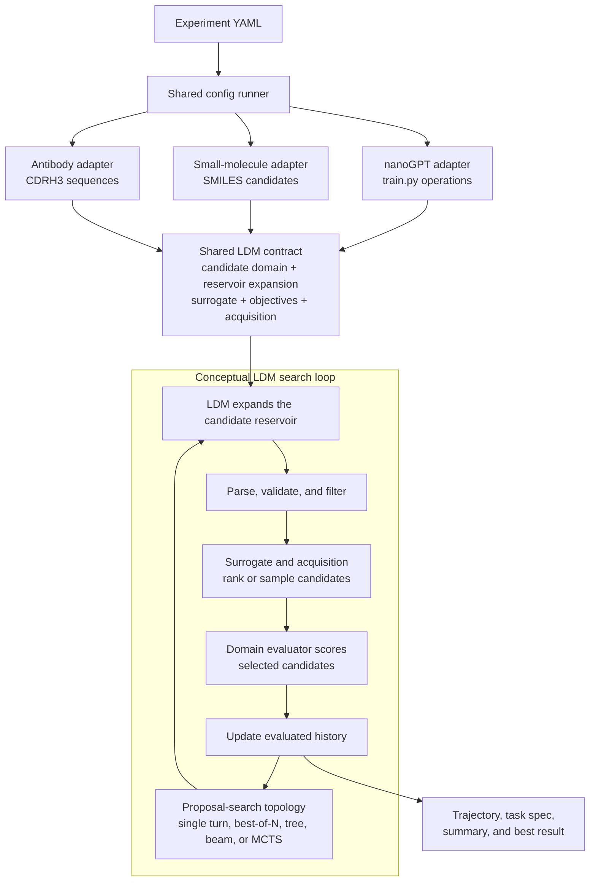

<h1 align="center">
  Large Discovery Models (LDM v0.1):<br>
  Empirically-grounded Model-Based Open-Ended Search
</h1>

<p align="center">
  <a href="https://arxiv.org/abs/2608.15669" title="Read the arXiv paper"></a>
  <a href="https://huggingface.co/Yangtze-ailab" title="View our models on Hugging Face"></a>
  <a href="https://largediscovery.net/" title="Visit the Large Discovery website"></a>
  
  <a href="assets/wechat_group_invitation.JPG" title="Join our WeChat group"></a>
  <a href="https://delta-infra-dashboard-test.yangtzeailab.com/" title="Delta-CLI | Compute"></a>
</p>

<p align="center">
  <a href="assets/evolution.drawio.pdf">
    
  </a>
</p>

<p align="center"><em>From producing an answer, to reasoning about an answer,
to managing an open-ended discovery process.</em></p>

**LDM is not primarily a model that tries once to generate an accurate
answer. It is a model that understands and steers the research process that
produces better answers over time.**

An LLM supplies structured candidate generation; a probabilistic surrogate
turns external observations into predictions and epistemic uncertainty; and
an acquisition function turns that search state into the next decision. The
result is a recurrent `generate -> select -> evaluate -> update` loop grounded
in evidence rather than model confidence alone.

### Updates

- **[Customization and Delta-Infra]** Add your own task with
  [`skills/register-ldm-task`](skills/register-ldm-task/SKILL.md), or run an
  existing LDM campaign through *Delta-Infra*. See the
  [ready-to-run examples](ready2run_examples/README.md).

- **August 2026 - LDM v0.1 release candidate.** The release candidate includes end-to-end
  LDM workflows for language-model training, small-molecule discovery, and
  antibody design, adaptive KV-cache quantization, mutation-effect prediction,
  and a manifest-driven interface for user-defined tasks.

## Contents

- [Repository Scope](#repository-scope)
- [The Research Loop](#the-research-loop)
- [Real Campaign Examples](#real-campaign-examples)
- [Run a demo with Delta-Infra: Hassle-Free and Ready-to-Run](#run-a-demo-with-delta-infra-hassle-free-and-ready-to-run)
- [Quick Start](#quick-start)
- [Environment Setup](#environment-setup)
- [Dependency Checks](#dependency-checks)
- [Config-Driven Runs](#config-driven-runs)
- [LDM Algorithm Abstraction](#ldm-algorithm-abstraction)
- [Codebase Architecture](#codebase-architecture)
- [Outputs And Logs](#outputs-and-logs)
- [Data Collection And Augmentation](#data-collection-and-augmentation)
- [Fine-Tuning The Proposal Model](#fine-tuning-the-proposal-model)
- [Customization](#customization)

## Repository Scope

| Task | Optimizes | Start Here | Reference |
| --- | --- | --- | --- |
| `nanogpt` | Training-code and hyperparameter operations for nanoGPT-style pretraining. | [Clean-room quick start](tasks/nanogpt/QUICKSTART.md) | [Task guide](tasks/nanogpt/README.md) |
| `small_molecule` | SMILES candidates for docking and activity objectives. | [Clean-room quick start](tasks/small_molecule/QUICKSTART.md) | [Task guide](tasks/small_molecule/README.md) |
| `antibody` | CDRH3 amino-acid sequences for antigen binding. | [Clean-room quick start](tasks/antibody/QUICKSTART.md) | [Task guide](tasks/antibody/README.md) |
| `llm_kv_adaptive_quantization` (adopted from [MLS-Bench](https://github.com/Imbernoulli/MLS-Bench)) | Adaptive KV-cache quantization policies for language-model quality and compression. | [Clean-room quick start](tasks/llm_kv_adaptive_quantization/QUICKSTART.md) | [Task guide](tasks/llm_kv_adaptive_quantization/README.md); added with [`skills/register-ldm-task`](skills/register-ldm-task/SKILL.md); [registration and Delta workflow](ready2run_examples/run_customized_llm_kv_adaptive_quantization/TASK_REGISTRATION_WORKFLOW.md) |
| `ai4bio_mutation_effect_prediction` (adopted from [MLS-Bench](https://github.com/Imbernoulli/MLS-Bench)) | Bounded mutation-effect predictor architectures evaluated on three pinned ProteinGym assays through MLS-Bench. | [Clean-room quick start](tasks/ai4bio_mutation_effect_prediction/QUICKSTART.md) | [Task guide](tasks/ai4bio_mutation_effect_prediction/README.md); added with [`skills/register-ldm-task`](skills/register-ldm-task/SKILL.md); [registration and Delta workflow](ready2run_examples/run_customized_ai4bio_mutation_effect_prediction/REGISTER_AND_DELTA_WORKFLOW.md) |
| `causal_discovery_discrete` (adopted from [MLS-Bench](https://github.com/Imbernoulli/MLS-Bench)) | Bounded discrete causal-graph discovery evaluated on five pinned Bayesian-network datasets through MLS-Bench. | [Clean-room quick start](tasks/causal_discovery_discrete/QUICKSTART.md) | [Task guide](tasks/causal_discovery_discrete/README.md); added with [`skills/register-ldm-task`](skills/register-ldm-task/SKILL.md); [recorded Delta campaign](ready2run_examples/run_customized_causal_discovery_discrete/) |
| ... (**more to come**)| ... (**stay tuned**) | ... | ... |
| `your_task` | User-defined candidates and measurable objectives in any domain. | [Use `$register-ldm-task`](skills/register-ldm-task/SKILL.md) | [Task registration guide](tasks/README.md) |

The six built-in clean-room guides begin with deterministic mock or CPU-safe gates and
progress through locked installation, dependency preflight, artifact checks,
and credential cleanup before any costly run. The evaluator-backed campaign
examples below additionally cover real GPU nanoGPT training, Vina plus G12D
scoring, Absolut evaluation, and the pinned three-assay MLS-Bench mutation
predictor and five-network discrete causal-discovery evaluations. Run the
documented commands from the repository root.

Task registration and conventional layout validation pass for all six
built-ins. The nanoGPT, small-molecule, antibody, and adaptive KV-cache tasks
retain `draft` experiment contracts and should be treated as runnable examples,
not benchmark-qualified implementations. The AI4Bio mutation-effect and
discrete causal-discovery tasks have source-pinned qualified contracts and
machine-readable evidence through `campaign_qualified`. AI4Bio includes an
official one-iteration campaign and separately labeled 3- and 20-iteration
extended-budget runs. Discrete causal discovery includes a separately labeled
20-iteration extended-budget run with 100 official network jobs. Qualification
is task-specific; evidence from either qualified task does not qualify the
other adapters.

Task authors can add a manifest-registered adapter without editing the shared
runner. See [Registering LDM Tasks](tasks/README.md) or use the repository-local
agent workflows cataloged under [`skills/`](skills/README.md):

- `register-ldm-task` scaffolds and implements a new task.
- `run-ldm-task` validates and progressively executes an existing task.

## The Research Loop

Within each discovery round, the LLM supplies a candidate reservoir while a GP
surrogate and acquisition function tilt search toward promising candidates.
Evaluation feedback updates the surrogate and model context in the fast loop;
the accumulated test-time-search data can also support slower model updates.

[](assets/loop.drawio.pdf)

*The LDM optimization loop. Click the figure to open the original PDF.*

## Real Campaign Examples

The repository includes three compact plots from evaluator-backed campaigns in
[`assets/examples/real_100_20260809/`](assets/examples/real_100_20260809/README.md).
They establish that all three adapters run end to end and that their observed
incumbents improve under the configured LDM loops.

| Antibody: UCB, 100 evaluations | Small molecule: EHVI, 100 evaluations | nanoGPT: LCB, 100 iterations |
| --- | --- | --- |
|  |  |  |

| Task | Real evidence | Observed result |
| --- | --- | --- |
| Antibody | 100 Absolut evaluations on `1ADQ_A`; 20 initialization evaluations followed by 80 UCB selections. | Best binding energy improved from -88.56 after initialization to -96.72. |
| Small molecule | 100 Vina plus G12D activity evaluations with EHVI selection. | Pareto hypervolume reached 22.8080517046179. |
| nanoGPT | 20 warm-up attempts followed by 100 LCB iterations; 99 outer candidates reached real training, for 116 finite observations overall. | Best finite `val_bpb` improved from 0.986220 in warm-up to 0.981844. |

The nanoGPT launcher completed with return code 0. Three failed warm-up
evaluations and one invalid outer candidate at iteration 83 are recorded in the
run artifacts and excluded from GP fitting and the plot. Improving curves are
evidence of optimization progress, not a controlled causal estimate of the LDM
component. Establishing an LDM advantage requires multiple seeds and matched
random, pure-LLM, BO-only, and acquisition-ablation baselines.

Three additional registered-task campaigns are shown separately because their
budgets and evidence claims differ from the three 100-evaluation examples
above. Adaptive KV-cache quantization is a non-official diagnostic campaign and
remains `draft`; AI4Bio reports official MLS-Bench evaluations from a separately
labeled 20-iteration extended-budget campaign; discrete causal discovery reports
official MLS-Bench scores from 20 five-network evaluations under its separately
labeled extended-budget profile.

| [Adaptive KV-cache quantization](ready2run_examples/run_customized_llm_kv_adaptive_quantization/TASK_REGISTRATION_WORKFLOW.md): GP-UCB, 20 diagnostic evaluations | [AI4Bio mutation-effect prediction](ready2run_examples/run_customized_ai4bio_mutation_effect_prediction/REGISTER_AND_DELTA_WORKFLOW.md): GP-UCB, 20 official evaluations | [Discrete causal discovery](ready2run_examples/run_customized_causal_discovery_discrete/): GP-UCB, 20 official evaluations |
| --- | --- | --- |
| [](ready2run_examples/run_customized_llm_kv_adaptive_quantization/progress.png) | [](ready2run_examples/run_customized_ai4bio_mutation_effect_prediction/progress.png) | [](ready2run_examples/run_customized_causal_discovery_discrete/progress.png) |
| Twenty Qwen-generated four-candidate reservoirs and 20 successful one-example HotpotQA evaluations. Best non-official selection score: `0.4979345`. | Twenty deterministic four-candidate reservoirs and 20 successful three-assay ProteinGym evaluations. Best official score: `0.4872663032443121` at iteration 14. | Twenty deterministic four-candidate reservoirs and 20 successful five-network evaluations, totaling 100 benchmark jobs. Best official score: `0.02766568667561009`, first reached at iteration 6. |

Use the [agent execution guide](docs/agent-execution.md) for the machine-oriented execution,
validation, resume, plotting, and safety checklist. Use
[`scripts/plot_campaigns.py`](scripts/plot_campaigns.py) to regenerate the
three original trajectory views from persisted artifacts.

## Run a demo with Delta-Infra: Hassle-Free and Ready-to-Run

For a cloud-backed path that does not require configuring GPUs, model servers,
and scientific evaluators on the local machine, start with the
[ready-to-run examples](ready2run_examples/README.md). They use
[Delta-Infra](https://delta-infra-dashboard-test.yangtzeailab.com/) to give
local AI agents access to isolated CPU/GPU sandboxes, shared model endpoints,
and managed scientific tools through `delta-cli`.

Install the CLI and agent skills, then authenticate with a Delta-Infra Bearer
token:

```bash
npx @delta-infra/cli@latest install
delta-cli --version
delta-cli auth login --token <your-token>
delta-cli auth status
```

Choose the workflow that matches your goal:

| Goal | Delta-Infra runbook |
| --- | --- |
| Run small-molecule discovery with real Qwen inference, Vina docking, and G12D activity prediction | [Small-molecule workflow](ready2run_examples/run_small_molecule_w_delta_infra/DELTA_CLI_WORKFLOW.md) |
| Propose antibody CDRH3 sequences and evaluate them with the managed AntBO/Absolut service | [Antibody workflow](ready2run_examples/run_antibody_w_delta_infra/DELTA_CLI_WORKFLOW.md) |
| Register a user-defined task and run a diagnostic campaign | [Custom-task registration workflow](ready2run_examples/run_customized_llm_kv_adaptive_quantization/TASK_REGISTRATION_WORKFLOW.md) |
| Register and qualify the AI4Bio mutation-effect task, then run an official or extended-budget campaign | [AI4Bio registration and Delta workflow](ready2run_examples/run_customized_ai4bio_mutation_effect_prediction/REGISTER_AND_DELTA_WORKFLOW.md) |

You can also give a coding agent a goal-oriented prompt and let the checked-in
skills and runbooks drive preflight, execution, monitoring, artifact transfer,
and cleanup. For example:

```text
Use the delta-cli skills to run an LDM campaign on the antibody task. Read the
task guide and checked-in config, perform the required preflight checks, start
with the documented smoke or tiny run, monitor it to a terminal state, collect
the run artifacts, and release all Delta-Infra resources.
```

```text
Read skills/register-ldm-task/SKILL.md and register <CUSTOMIZED_TASK> as a new
LDM task. Use delta-cli for mock and dependency preflight tests and, after the
qualification gates pass, run the documented tiny real campaign. Preserve
machine-readable qualification evidence and clean up every sandbox.
```

For the newly registered benchmark task, a concrete campaign prompt is:

```text
Use the delta-cli skills to run the checked-in 3-iteration LDM campaign for
ai4bio_mutation_effect_prediction. Validate the campaign profile, monitor the
run to completion, pull the complete run directory, summarize the result and
trajectory, and release the sandbox.
```

The [complete ready-to-run guide](ready2run_examples/README.md) also covers
alternative installation methods, configuration checks, a sandbox smoke test,
resource cleanup, credential safety, and the evidence boundary of each
recorded run. Read the selected runbook before allocating cloud resources;
each workflow has specific image, model, timeout, and evaluator requirements.

## Quick Start

Start from the repository root:

```bash
cd /path/to/LDM_merge
```

Install the locked shared development environment, then the task environments
you plan to use:

```bash
uv sync --locked --group dev
uv sync --locked --project tasks/nanogpt
uv sync --locked --project tasks/small_molecule
uv sync --locked --project tasks/antibody
```

List configs and preview the mock suite:

```bash
uv run --locked python scripts/validate_tasks.py
uv run --locked python scripts/run_ldm_tts.py --list
uv run --locked python scripts/run_ldm_tts.py config/suites/mock_all.yaml --dry-run
```

Run fast mock experiments:

```bash
uv run --locked --project tasks/nanogpt \
  python scripts/run_ldm_tts.py config/nanogpt/mock_best_of_n.yaml
CUDA_VISIBLE_DEVICES='' uv run --locked --project tasks/small_molecule \
  python scripts/run_ldm_tts.py config/small_molecule/mock_m1_stratified_oversample.yaml
CUDA_VISIBLE_DEVICES='' uv run --locked --project tasks/antibody \
  python scripts/run_ldm_tts.py config/antibody/mock_ei.yaml
```

Mock configs are the safest first check. They exercise the merged runner,
task-space specs, response parsing, and trajectory plumbing without requiring
real LLM endpoints or domain-specific external tools.

## Environment Setup

Real experiments need an OpenAI-compatible LLM endpoint. CUDA requirements are
task-specific; the validated small-molecule direct and antibody smoke paths are
CPU-only:

```bash
export CUDA_VISIBLE_DEVICES=''
export LLM_BASE_URL=https://your-model-host.example/v1
export LLM_API_KEY=your-api-key
export LLM_MODEL_NAME=your-served-model
```

nanoGPT also accepts its historical LLM variable names:

```bash
export TTS_LLM_URL=$LLM_BASE_URL
export TTS_LLM_API_KEY=$LLM_API_KEY
export TTS_LLM_MODEL=$LLM_MODEL_NAME
```

### OpenAI-Compatible Served Model API

Real runs (`mock: false`) require a reachable served chat model or model API;
mock smoke runs do not contact an LLM endpoint.

All three task adapters support an OpenAI-compatible Chat Completions API,
including models served locally by vLLM, SGLang, or another compatible server,
and authenticated remote gateways such as LiteLLM. `LLM_BASE_URL` must be the
API root, normally ending in `/v1`; do not include `/chat/completions`, because
the OpenAI client appends that route. `LLM_MODEL_NAME` must match a model ID
advertised by the server.

Use `EMPTY` when a local server requires the Authorization header but does not
validate credentials. Use the actual secret for remote or authenticated APIs.
Do not commit real keys to YAML or `.env` files.

Provider settings should remain environment-only. Set optional provider fields
to `null` in committed configs so the task adapter reads the environment and
secrets do not enter process arguments or dry-run output:

```yaml
args:
  llm-url: null
  api-key: null
  llm-model-name: null
```

Verify model discovery and Chat Completions before launching a real search.
Use the environment-only Python probe in the relevant
[nanoGPT](tasks/nanogpt/QUICKSTART.md#8-optional-real-run-preparation),
[small-molecule](tasks/small_molecule/QUICKSTART.md#6-probe-the-model-api), or
[antibody](tasks/antibody/QUICKSTART.md#5-probe-the-model-api) quick start.
The dependency checker validates that URL, model, and key settings are present;
the probe additionally verifies the routes used at runtime.

Small-molecule real runs need additional task dependency paths:

```bash
export VINA_BIN=/path/to/vina
export G12D=/trusted/path/best_g12d_model.joblib
export REASYN_REPO=/path/to/ReaSyn
export REASYN_PYTHON=/path/to/ReaSyn/.venv/bin/python
```

The G12D joblib artifact is not distributed in Git, and this project does not
currently document a public download URL. Obtain a compatible artifact from a
trusted project maintainer or train and validate one locally. The conventional
ignored location is
`tasks/small_molecule/resources/models/best_g12d_model.joblib`, but `G12D` may
point anywhere. See the [model trust and checksum instructions](tasks/small_molecule/resources/README.md)
before loading it.

Antibody real runs require an external Absolut installation. Prefer
`ABSOLUT_PATH=/path/to/Absolut` or `--absolut-path` instead of editing the
committed task config.

Non-secret dependency paths can also be set under config `env:` or passed as
explicit task CLI arguments. Keep API keys in the process environment.

## Dependency Checks

Before running task-relevant real experiments, run the dependency checker on
the exact config you plan to use:

```bash
uv run --locked --project tasks/nanogpt \
  python scripts/check_task_dependencies.py config/nanogpt/real_operation_tool_best_of_n.yaml
CUDA_VISIBLE_DEVICES='' uv run --locked --project tasks/small_molecule \
  python scripts/check_task_dependencies.py \
  config/small_molecule/real_m1_seed_analog.yaml --no-optional
CUDA_VISIBLE_DEVICES='' uv run --locked --project tasks/antibody \
  python scripts/check_task_dependencies.py config/antibody/real_cpu_smoke.yaml
```

The checker reads the same YAML configs as the runner and reports `OK`,
`WARN`, `FAIL`, or `SKIP` for each dependency. It checks lightweight things
only: configured LLM settings, CUDA visibility, file paths, Vina executability,
ReaSyn checkout/imports/checkpoints, nanoGPT data artifacts, antigen inputs, and
the Absolut executable. The complete clean installation workflows are in the
[nanoGPT](tasks/nanogpt/QUICKSTART.md),
[small-molecule](tasks/small_molecule/QUICKSTART.md), and
[antibody](tasks/antibody/QUICKSTART.md) quick starts.

If a config mentions optional dependencies that the selected method will not
use, such as ReaSyn paths in a direct-only small-molecule run, add
`--no-optional`. For nanoGPT, this also skips `prepare.py` data and tokenizer
checks only when the resolved plan sets `args.skip-eval: true`. Evaluated runs
continue to treat missing training data as a blocking failure.

Use the staged first-real-run guide for the task you are deploying:

- [nanoGPT clean-room quick start](tasks/nanogpt/QUICKSTART.md)
- [Small-molecule clean-room quick start](tasks/small_molecule/QUICKSTART.md)
- [Antibody clean-room quick start](tasks/antibody/QUICKSTART.md)

Use overrides exactly as with the runner:

```bash
uv run --locked --project tasks/small_molecule \
  python scripts/check_task_dependencies.py \
  config/small_molecule/real_m1_seed_analog.yaml \
  --set args.vina-bin=/path/to/vina
```

The shared runner automatically performs the manifest-declared dependency
preflight before every non-mock execution and blocks on `FAIL`. The standalone
checker remains useful for an earlier report and supports `--no-optional`.
`scripts/run_ldm_tts.py --skip-preflight` is reserved for controlled
diagnostics; it should not be used to launch a real campaign.

## Config-Driven Runs

Experiments are YAML files under `config/`. A config selects the task,
algorithm label, mode, environment variables, and task CLI arguments.

Minimal shape:

```yaml
name: small_molecule_mock_m1
task: small_molecule
algorithm: m1_stratified_direct_llm_oversample_sir
mode: mock
args:
  mock: true
  budget: 8
  batch-size: 1
```

Important fields:

| Field | Meaning |
| --- | --- |
| `name` | Human-readable run name. |
| `task` | One of `nanogpt`, `small_molecule`, or `antibody`. |
| `algorithm` | Bookkeeping label for the run style. |
| `mode` | Usually `mock` or `real`. |
| `contract_profile` | Optional named `experiment.json` profile whose locked arguments the runner enforces. |
| `env` | Environment variables set for the run. |
| `args` | CLI options passed to the task workflow, without the leading `--`. |
| `runner` | Optional task module or working-directory override. |

Useful commands:

```bash
python scripts/run_ldm_tts.py config/small_molecule/mock_m1_stratified_oversample.yaml --dry-run
python scripts/run_ldm_tts.py config/suites/mock_all.yaml
```

Override config values with dotted paths:

```bash
python scripts/run_ldm_tts.py config/nanogpt/mock_best_of_n.yaml \
  --set args.iterations=5 \
  --set args.run-name=nanogpt_mock_iter5
```

Config values support:

- `null` to omit an optional CLI argument and let the task default apply
- runner placeholders such as `{repo_root}` and `{task_dir}`
- environment references in `args`, such as `vina-bin: ${VINA_BIN}`
- repository-root expansion for values starting with `tasks/`, `config/`,
  `data/`, `ldm_tts/`, or `scripts/`

Suite configs contain an `experiments` list and run the listed configs
sequentially.

## LDM Algorithm Abstraction

LDM-TTS treats LDM as a task-neutral, closed-loop discovery contract rather
than one domain-specific optimizer. Each task adapter describes its candidate
domain, finite reservoir, reservoir-expansion actions, surrogate
representation, objectives, structured LLM responses, proposal-search
topology, and acquisition rule through an `LDMTaskSpec`, then supplies the
domain evaluator. The shared layer provides config dispatch, proposal
traversal, acquisition scoring, validation, budget, and trajectory utilities.
Adapters own domain validation, surrogate encoding, and evaluation.

The canonical terminology is defined in [LDM discovery concepts](docs/concepts.md). In particular, the
candidate domain is the complete set of valid solutions, the reservoir is the
finite set available for selection in one discovery step, reservoir expansion
is how LDM adds to that set, and the surrogate representation is what the GP or
other surrogate consumes. Candidate flexibility and surrogate dimension are
therefore independent properties.

The ideal LDM policy is an acquisition-tilted version of the structured
generative prior:

```math
\pi_t(x) \propto
p_{\theta,\alpha}(x \mid \mathcal{C}_t)
\exp\!\left\{\eta\,a_t(x)\right\}.
```



The three adapters instantiate the same roles with different domain objects:

| Task | Candidate domain | Reservoir expansion | Surrogate representation | External evaluation |
| --- | --- | --- | --- | --- |
| `nanogpt` | Valid `train.py` programs. | Code edits or structured parameter edits; the expansion schema may activate additional parameters. | Fixed code hash vector, fixed operation vector, or evolving operation vector. | Run the generated training program and optimize `val_bpb` or another configured metric. |
| `small_molecule` | Valid canonical SMILES. | Direct SMILES emission or seed-conditioned analogue generation. | Fixed molecular fingerprint or implicit SMILES string kernel; direct-only modes use none. | Minimize AutoDock Vina score while maximizing predicted KRAS G12D activity. |
| `antibody` | Valid fixed-length CDRH3 sequences. | Direct sequence emission or DSL-policy-guided sequence generation. | Fixed categorical sequence representation; direct-only modes use none. | Minimize Absolut binding energy for the selected antigen. |

The shared code keeps orchestration, config loading, task-space specs, response
parsing, trajectory metadata, and common tests in one place. Task adapters keep
domain-specific dependencies such as training data, Vina, ReaSyn, and Absolut
behind task boundaries.

### LDM Campaign Algorithm

`ldm_tts.campaign.run_campaign` is the deep task-neutral interface for an
experiment. A caller supplies one `CampaignRecipe` containing only the
scientific adapters and one `CampaignBudget`; the shared implementation uses
`LDMEngine` internally to execute the lifecycle declared by `LDMTaskSpec`:

```text
reservoir expansion
  -> candidate admission and deduplication
  -> surrogate/acquisition selection
  -> external evaluation
  -> authoritative observation
  -> durable campaign checkpoint
```

The campaign algorithm owns runtime creation, exact partial batches,
successful-result targets, failed-evaluation replacement, lifecycle policy,
budget enforcement, failure classification, event recording, checkpoints,
resume, and summaries. A task supplies adapters at the scientific seams:

| Interface | Task-owned responsibility | Shared implementation |
| --- | --- | --- |
| `ReservoirExpander` | Turn history and expansion schema into raw proposals. | Expansion request/result records and direct-emission adapter. |
| `CandidateDomainAdapter` | Canonicalize and scientifically validate one proposal. | History exclusion, deduplication, capacity, and rejection accounting. |
| `SurrogateEncoder` | Encode an admitted candidate. | Versioned surrogate vectors and shared GP-UCB selector. |
| `CandidateEvaluator` | Run the external scientific measurement. | Status classification, objective validation, observation records, and budgets. |
| `ProposalClient` | Provide model transport without scientific behavior. | OpenAI-compatible retries, circuit breaking, timing, usage, text, and tool calls. |

`CampaignRuntime` writes a common `campaign.json`, `budget.json`, `status.json`,
`events.jsonl`, `checkpoint.json`, `ldm_task_spec.json`, and `summary.json`
contract. Every built-in task — `nanogpt`, `small_molecule`, `antibody`,
`llm_kv_adaptive_quantization`, `causal_discovery_discrete`, and
`ai4bio_mutation_effect_prediction` — calls the shared campaign interface and
delegates lifecycle ownership to it; the tasks keep exporting their historical
trajectory files (for example `small_molecule`'s `history.json`/`rounds.jsonl`
and `antibody`'s `results.csv`/`llm_acq_decisions.jsonl`) from engine events so
downstream tooling keeps working.

The declarative and behavioral layers deliberately stay separate:
`ReservoirExpansionSpec` describes what a task permits, while a
`ReservoirExpander` performs it. The engine does not own scientific payloads,
prompt contents, domain validation, evaluator internals, or specialized
surrogate backends.

### Proposal Search

Proposal search controls how LLM-generated candidate states are traversed
within one optimization round. The implementations live in
`ldm_tts.optimization.search` behind a task-neutral engine protocol. `single_turn` is
the one-level special case; `best_of_n`, `tree_search`, `beam_search`, and
`mcts` support deeper state traversal. Public aliases such as `beam` and `tree`
resolve through the shared registry.

Proposal search is intentionally separate from acquisition and the outer
budgeted loop. For example, antibody and small molecule use one-turn LLM
outputs but still repeat proposal, acquisition, domain evaluation, and history
updates until their task budgets are exhausted. Their complete optimizers are
therefore iterative even though their `proposal_search` is `single_turn`.

### Acquisition Configuration

Acquisition functions are selected in experiment YAML under `args`. The shared
`ldm_tts.optimization.acquisition.PosteriorAcquisition` implementation always returns a
larger-is-better score and applies the configured objective direction.

| Task | Config key | Supported values | Related parameters |
| --- | --- | --- | --- |
| `nanogpt` | `surrogate-mode` | `lcb`, `ucb`, `ei`, `mean` | `gp-beta`, `gp-xi` |
| `antibody` | `acq` | `lcb`, `ucb`, `ei`, `mean` | `acq-beta`, `acq-xi` |
| `small_molecule` | `acq` | `ehvi`, `mean` | `acq-weights` (Vina, activity), `ehvi-n-samples` |

For example, a small-molecule posterior-mean run uses `acq: mean` and
`acq-weights: 0.5,0.5`. The same acquisition implementation is used across
tasks; only the surrogate/posterior adapter remains domain-specific.

## Codebase Architecture

The codebase has four layers:

| Layer | Where | Responsibility |
| --- | --- | --- |
| Shared runner | `ldm_tts.cli.runner`, `scripts/run_ldm_tts.py` | Load configs, build commands, run suites, and provide dry-runs. |
| Shared algorithms | `ldm_tts/` | Describe task spaces, traverse proposal states, implement acquisition scoring and budgets, parse responses, and serialize traces. |
| Task adapters | `tasks/<task>/ldm_task/procedure.py` | Provide a thin, stable entry point for the shared runner. |
| Task implementations | `tasks/<task>/core/` | Own prompts, LLM/provider calls, reservoir expansion adapters, surrogate representations, domain scoring, resume behavior, and output writing. |

Key shared packages:

| Module | Purpose |
| --- | --- |
| `ldm_tts.contracts` | `LDMTaskSpec`, candidate domains, reservoirs, reservoir-expansion actions, surrogate representations, objectives, response spaces, proposal-search specs, and acquisition specs. |
| `ldm_tts.optimization.search` | Shared `single_turn`, best-of-N, tree, beam, and MCTS proposal traversal behind a generic engine protocol and registry. |
| `ldm_tts.optimization.acquisition` | Shared `mean`, `EI`, `LCB`, `UCB`, and two-objective `EHVI` implementation behind one posterior-scoring interface. |
| `ldm_tts.transport.parsing` | Shared LLM JSON extraction and validation helpers. |
| `tasks.nanogpt.core.expansion_schema` | Structured expansion-schema parameters, surrogate representation dimensions, and compatibility helpers. |
| `ldm_tts.optimization.records` | Lightweight BO records and protocols. |
| `ldm_tts.engine` | Campaign orchestration, reservoir expansion, budgets, events, checkpoints, and run artifacts. |
| `ldm_tts.transport` | Proposal transport interface, OpenAI-compatible adapter, and response parsing. |
| `ldm_tts.registration` | Manifest discovery, experiment contracts, scaffolding, and generic dependency-check primitives. |
| `ldm_tts.data` | Runtime collection, ldm-2.0 intermediate records, rendering, and expert augmentation. |
| `ldm_tts.cli` | Configuration expansion and command-line campaign execution. |

The shared package should remain dependency-light. Heavy domain dependencies
such as RDKit, torch, gpytorch, Vina, ReaSyn, and Absolut should stay inside
task packages or task setup instructions.

## Outputs And Logs

Common run artifacts:

| Artifact | Meaning |
| --- | --- |
| `summary.json` | Task-level run summary. |
| `model_based_summary.json` | nanoGPT model-based search summary. |
| `ldm_task_spec.json` | Serialized task-space contract for the run. |
| `config.json` | Trajectory config snapshot. |
| `rounds.jsonl` or task-specific JSONL logs | Per-round candidates, decisions, scores, and diagnostics. |
| `model_based_buffer.jsonl` | nanoGPT evaluated-state buffer for GP fitting and resume. |
| `vina_cache/` | Small-molecule docking and receptor-preparation cache. |

Generated runs, caches, scratch files, plots, notebooks, local virtual
environments, and `.env` files should stay out of git. Curated documentation
figures under `assets/` and provenance-documented campaign plots under
`assets/examples/` are the only plot exceptions.

## Data Collection And Augmentation

Accepted teacher actions can be collected during task execution as ldm-2.0 IR,
then augmented with expert justification and rendered for LlamaFactory through
the shared `ldm_tts.data` interface. The compact [data pipeline](data/README.md)
keeps the schema, examples, offline tools, and training configuration together,
while generated campaigns use one ignored directory each. See
[data-collection guide](docs/data-collection.md) for the task hooks, quality rules, and
full CLI workflow.

## Fine-Tuning The Proposal Model

Collected LDM-TTS trajectories can be distilled into a proposal model that emits
the same JSON action contract used by the search loop. The training target is an
accepted teacher proposal before BO selection or evaluation:

```json
{"type":"propose","reasoning":"<visible rationale>","payload":{},"summary":"..."}
```

Reasoning remains a visible field in the parseable JSON response rather than a
hidden `<think>...</think>` channel. This keeps the trained model compatible with
the existing prompts, validators, and task response parsers.

Start with reasoning-augmented `ldm-2.0` IR produced by the
[data pipeline](data/README.md). Prepare deterministic train and evaluation
shards from the repository root:

```bash
python finetune/prepare_dataset.py \
  --input data/generated/my_campaign/ldm_ir_augmented.jsonl \
  --output-dir data/generated/full_sft \
  --eval-fraction 0.10 \
  --seed 42
```

The preparation command validates IR, excludes records without supported
reasoning, and assigns whole runs, trajectories, antigens, or seeds to either
training or evaluation. Do not use a random row-level split: adjacent rounds
from the same search trajectory would leak context into validation. Generated
shards, their LlamaFactory registry, split metadata, and checkpoints remain under
the ignored `data/generated/full_sft/` directory.

Run the documented IR and Alpaca quality gates before training. Then initialize
the pinned LlamaFactory submodule and launch the full-parameter Qwen example:

```bash
git submodule update --init --recursive finetune/LLaMA-Factory

cd finetune
FORCE_TORCHRUN=1 CUDA_VISIBLE_DEVICES=0,1,2,3 \
  llamafactory-cli train config/full_sft_rationale.yaml
```

The example uses full-parameter SFT of `Qwen/Qwen3.5-9B`, DeepSpeed ZeRO-3 CPU
offload, explicit provenance-held-out evaluation data, and the
`qwen3_5_nothink` template. A smaller LoRA baseline remains available at
[`data/ldm_lora_sft.yaml`](data/ldm_lora_sft.yaml). See the
[full fine-tuning guide](finetune/README.md) for CUDA and DeepSpeed installation,
dataset auditing, context-length checks, checkpoint handling, and inference-time
prompt parity.

## Customization

Start from the closest YAML file under `config/`, then edit `env` and `args`.
Run both the dependency checker and runner dry-run before launching a real
experiment:

```bash
python scripts/check_task_dependencies.py config/small_molecule/real_m1_seed_analog.yaml
python scripts/run_ldm_tts.py config/small_molecule/real_m1_seed_analog.yaml --dry-run
```

To add a task, scaffold a conventional adapter and register it with a local
manifest. Shared runner and dependency-dispatch code do not need modification:

```bash
python scripts/scaffold_task.py protein_design \
  --description "Optimize protein candidates against structure objectives."
python scripts/validate_tasks.py --task protein_design
```

See [Registering LDM Tasks](tasks/README.md) for the complete manifest,
procedure, config, dependency-hook, data-collection, mock-run, and verification
contracts.

The [documentation index](docs/README.md) links the architecture terminology,
testing lanes, data-collection contract, agent execution guide, and project
policies.

See the task guides for domain-specific customization:

- [nanoGPT task guide](tasks/nanogpt/README.md)
- [Small-molecule task guide](tasks/small_molecule/README.md)
- [Antibody task guide](tasks/antibody/README.md)
